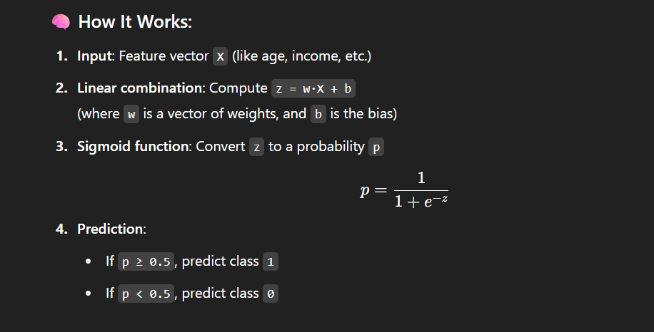

### What is classification ?

Classification in machine learning (ML) is a type of supervised learning where the goal is to predict a category or class label for a given input.

#### Examples

- Spam detection: Email → Spam or Not Spam
- mage recognition: Image → Cat, Dog, or Horse
- Medical diagnosis: Symptoms → Disease A, B, or C
- Sentiment analysis: Review → Positive, Negative, or Neutral

#### How it works?

1. Training data: The model is trained on labeled data (input + correct class).
2. Learning: The algorithm finds patterns in the training data that distinguish the classes.
3. Prediction: For new, unseen data, the model assigns the most likely class label.

#### Common Algorithms Used in Classification

1. Logistic Regression
2. Decision Trees
3. Random Forest
4. Support Vector Machines (SVM)
5. K-Nearest Neighbors (KNN)
6. Naive Bayes
7. Neural Networks (Deep Learning)

#### Types of Classification

1. Binary Classification: Only two classes (e.g., yes/no).
2. Multi class Classification: More than two classes (e.g., cat/dog/rabbit).
3. Multi label Classification: Each instance can belong to multiple classes at the same time.

## Logistic Regression

It models the probability that an input belongs to a certain class, using the logistic (sigmoid) function to squash the output into a value between 0 and 1.

#### Advantages

- Simple, fast, and efficient
- Outputs probabilities
- Works well for linearly separable data

#### Limitations

- Doesn't perform well on complex/non-linear relationships (unless features are transformed)
- Sensitive to outliers
